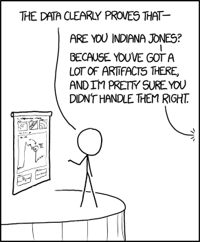

layout: true

<div class="my-footer">
  <span style="text-align:center">
    <span> 
      
    </span>
    <a href="https://therbootcamp.github.io/">
      <span style="padding-left:82px"> 
        <font color="#7E7E7E">
          www.therbootcamp.com
        </font>
      </span>
    </a>
    <a href="https://therbootcamp.github.io/">
      <font color="#7E7E7E">
      Einführung in die moderne Datenanalyse mit R | November 2019
      </font>
    </a>
    </span>
  </div> 

---

```{r setup, include=FALSE}
options(htmltools.dir.version = FALSE)
# see: https://github.com/yihui/xaringan
# install.packages("xaringan")
# see: 
# https://github.com/yihui/xaringan/wiki
# https://github.com/gnab/remark/wiki/Markdown
options(width=110)
options(digits = 4)

require(tidyverse)
```


# Agenda

.pull-left4[

1. R(Studio)<br>
2. Assignments<br>
3. Funktionen<br>
4. Data I/O<br>
5. <high>Analyse</high><br>
&nbsp;&nbsp;&nbsp;-Einfache Statistiken<br>
&nbsp;&nbsp;&nbsp;-Einfache Graphiken<br>
]

.pull-right5[
<p align = "center">
<br>
<font style="font-size:10px">from <a href="https://xkcd.com//">xkcd.com</a></font>
</p>

]

---

# Agenda

.pull-left4[

1. R(Studio)<br>
2. Assignments<br>
3. Funktionen<br>
4. Data I/O<br>
5. Analyse<br>
&nbsp;&nbsp;&nbsp;-<high>Einfache Statistiken</high><br>
&nbsp;&nbsp;&nbsp;-Einfache Graphiken<br>
]

.pull-right5[

```{r, echo = F}
options(max.print=80,width=40)
```

```{r}
# Lese Daten in ein Objekt ein
daten <- read.csv('1_Data/Tourismus.csv')

# Mittlere Dauer
mean(daten$Dauer)

# Median Dauer
median(daten$Dauer)

# Standardabweichung Dauer
sd(daten$Dauer)

```
]

---

# Agenda

.pull-left4[

1. R(Studio)<br>
2. Assignments<br>
3. Funktionen<br>
4. Data I/O<br>
5. Analyse<br>
&nbsp;&nbsp;&nbsp;-<high>Einfache Statistiken</high><br>
&nbsp;&nbsp;&nbsp;-Einfache Graphiken<br>
]

.pull-right5[

```{r, echo = F}
options(max.print=80,width=40)
```

```{r}
# Lese Daten in ein Objekt ein
daten <- read.csv('1_Data/Tourismus.csv')

# Zusammenfassung Dauer
summary(daten$Dauer)

```
]

---

# Agenda

.pull-left4[

1. R(Studio)<br>
2. Assignments<br>
3. Funktionen<br>
4. Data I/O<br>
5. Analyse<br>
&nbsp;&nbsp;&nbsp;-<high>Einfache Statistiken</high><br>
&nbsp;&nbsp;&nbsp;-Einfache Graphiken<br>
]

.pull-right5[

```{r, echo = F}
options(max.print=80,width=40)
```

```{r}
# Lese Daten in ein Objekt ein
daten <- read.csv('1_Data/Tourismus.csv')

# Zusammenhang Dauer und Besucher
cor(daten$Dauer, daten$Besucher)

```
]

---

# Agenda

.pull-left4[

1. R(Studio)<br>
2. Assignments<br>
3. Funktionen<br>
4. Data I/O<br>
5. Analyse<br>
&nbsp;&nbsp;&nbsp;-<high>Einfache Statistiken</high><br>
&nbsp;&nbsp;&nbsp;-Einfache Graphiken<br>
]

.pull-right5[

```{r, echo = F}
options(max.print=80,width=40)
```

```{r}
# Lese Daten in ein Objekt ein
daten <- read.csv('1_Data/Tourismus.csv')

# Dauer nach Region
aggregate(daten$Dauer, list(daten$Region), mean)

```
]

---

# Agenda

.pull-left4[

1. R(Studio)<br>
2. Assignments<br>
3. Funktionen<br>
4. Data I/O<br>
5. Analyse<br>
&nbsp;&nbsp;&nbsp;-<high>Einfache Statistiken</high><br>
&nbsp;&nbsp;&nbsp;-Einfache Graphiken<br>
]

.pull-right5[

```{r, echo = F}
options(max.print=80,width=40)
```

```{r}
# Lese Daten in ein Objekt ein
daten <- read.csv('1_Data/Tourismus.csv')

# Vergleich der Dauer nach Region
anova(lm(daten$Dauer ~ daten$Region))

```
]

---

# Agenda

.pull-left4[

1. R(Studio)<br>
2. Assignments<br>
3. Funktionen<br>
4. Data I/O<br>
5. Analyse<br>
&nbsp;&nbsp;&nbsp;-<high>Einfache Statistiken</high><br>
&nbsp;&nbsp;&nbsp;-Einfache Graphiken<br>
]

.pull-right5[

```{r, echo = F}
options(max.print=80,width=40)
```

```{r}
# Lese Daten in ein Objekt ein
daten <- read.csv('1_Data/Tourismus.csv')

# Vergleich der Dauer nach Region
anova(lm(daten$Besucher ~ daten$Region))

```
]

---

# Agenda

.pull-left4[

1. R(Studio)<br>
2. Assignments<br>
3. Funktionen<br>
4. Data I/O<br>
5. Analyse<br>
&nbsp;&nbsp;&nbsp;-Einfache Statistiken<br>
&nbsp;&nbsp;&nbsp;-<high>Einfache Graphiken</high><br>
]

.pull-right5[

```{r, echo = F}
options(max.print=80,width=40)
```

```{r, fig.height=5, fig.width=7, dpi=300}
# Histogramm Dauer
hist(daten$Dauer)

```
]

---

# Agenda

.pull-left4[

1. R(Studio)<br>
2. Assignments<br>
3. Funktionen<br>
4. Data I/O<br>
5. Analyse<br>
&nbsp;&nbsp;&nbsp;-Einfache Statistiken<br>
&nbsp;&nbsp;&nbsp;-<high>Einfache Graphiken</high><br>
]

.pull-right5[

```{r, echo = F}
options(max.print=80,width=40)
```

```{r, fig.height=5, fig.width=7, dpi=300}
# Histogramm Besucher
hist(daten$Besucher)

```
]

---

# Agenda

.pull-left4[

1. R(Studio)<br>
2. Assignments<br>
3. Funktionen<br>
4. Data I/O<br>
5. Analyse<br>
&nbsp;&nbsp;&nbsp;-Einfache Statistiken<br>
&nbsp;&nbsp;&nbsp;-<high>Einfache Graphiken</high><br>
]

.pull-right5[

```{r, echo = F}
options(max.print=80,width=40)
```

```{r, fig.height=5, fig.width=7, dpi=300}
# Streudiagram Besucher x Dauer
plot(daten$Besucher, daten$Dauer)

```
]

---

# Agenda

.pull-left4[

1. R(Studio)<br>
2. Assignments<br>
3. Funktionen<br>
4. Data I/O<br>
5. Analyse<br>
&nbsp;&nbsp;&nbsp;-Einfache Statistiken<br>
&nbsp;&nbsp;&nbsp;-<high>Einfache Graphiken</high><br>
]

.pull-right5[

```{r, echo = F}
options(max.print=80,width=40)
```

```{r, fig.height=5, fig.width=7, dpi=300}
# Streudiagram Besucher x Dauer
plot(daten$Besucher, daten$Dauer,
     log = "xy")

```
]

---

# Agenda

.pull-left4[

1. R(Studio)<br>
2. Assignments<br>
3. Funktionen<br>
4. Data I/O<br>
5. Analyse<br>
&nbsp;&nbsp;&nbsp;-Einfache Statistiken<br>
&nbsp;&nbsp;&nbsp;-<high>Einfache Graphiken</high><br>
]

.pull-right5[

```{r, echo = F}
options(max.print=80,width=40)
```

```{r, fig.height=5, fig.width=7, dpi=300}
# Streudiagram Besucher x Dauer
plot(daten$Besucher, daten$Dauer,
     log = "xy", col = 'red', pch = 16,
     xlab = 'Besucher', ylab = 'Dauer')

```
]

---

# Agenda

.pull-left4[

1. R(Studio)<br>
2. Assignments<br>
3. Funktionen<br>
4. Data I/O<br>
5. Analyse<br>
&nbsp;&nbsp;&nbsp;-Einfache Statistiken<br>
&nbsp;&nbsp;&nbsp;-<high>Einfache Graphiken</high><br>
]

.pull-right5[

```{r, echo = F}
options(max.print=80,width=40)
```

```{r, fig.height=5, fig.width=7, dpi=300}
# Boxplot Dauer nach Region
boxplot(daten$Dauer ~ daten$Region,
        log="y")
```
]

---

# Agenda

.pull-left4[

1. R(Studio)<br>
2. Assignments<br>
3. Funktionen<br>
4. Data I/O<br>
5. Analyse<br>
&nbsp;&nbsp;&nbsp;-Einfache Statistiken<br>
&nbsp;&nbsp;&nbsp;-<high>Einfache Graphiken</high><br>
]

.pull-right5[

```{r, echo = F}
options(max.print=80,width=40)
```

```{r, fig.height=5, fig.width=7, dpi=300}
# Boxplot Besucher nach Region
boxplot(daten$Besucher ~ daten$Region,
        log="y")
```
]


---

class: middle, center

<h1><high>Interactive</high></h1>


