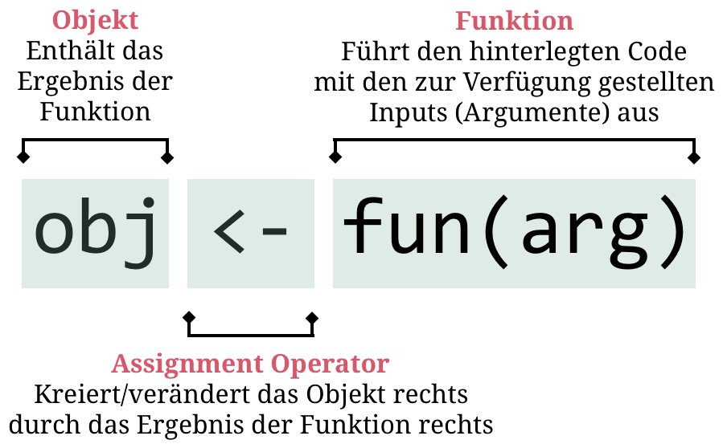

layout: true

<div class="my-footer">
  <span style="text-align:center">
    <span> 
      
    </span>
    <a href="https://therbootcamp.github.io/">
      <span style="padding-left:82px"> 
        <font color="#7E7E7E">
          www.therbootcamp.com
        </font>
      </span>
    </a>
    <a href="https://therbootcamp.github.io/">
      <font color="#7E7E7E">
      Einführung in die moderne Datenanalyse mit R | November 2019
      </font>
    </a>
    </span>
  </div> 

---

```{r setup, include=FALSE}
options(htmltools.dir.version = FALSE)
# see: https://github.com/yihui/xaringan
# install.packages("xaringan")
# see: 
# https://github.com/yihui/xaringan/wiki
# https://github.com/gnab/remark/wiki/Markdown
options(width=110)
options(digits = 4)

require(tidyverse)
```


.pull-left4[

# Agenda

1. R(Studio)<br>
2. <high>Assignments</high><br>
&nbsp;&nbsp;&nbsp;Objekt <mono><-</mono> Funktion<br>
&nbsp;&nbsp;&nbsp;<mono><-</mono> kreiert Objekte<br>
&nbsp;&nbsp;&nbsp;<mono><-</mono> verändert Objekte<br><br>
3. Funktionen<br>
4. Data I/O<br>
5. Analyse

]

.pull-right5[
<br><br>
<p align = "center">
<br>
<font style="font-size:10px">from <a href="https://xkcd.com//">xkcd.com</a></font>
</p>

]

---

# Objekt <mono><-</mono> Funktion

.pull-left5[

1. R(Studio)<br>
2. Assignments<br>
&nbsp;&nbsp;&nbsp;<high>Objekt <mono><-</mono> Funktion</high><br>
&nbsp;&nbsp;&nbsp;<mono><-</mono> kreiert Objekte<br>
&nbsp;&nbsp;&nbsp;<mono><-</mono> verändert Objekte<br><br>
3. Funktionen<br>
4. Data I/O<br>
5. Analyse

]

.pull-right5[

<p align="center">
  
</p>


]

---

# <mono><-</mono> kreiert Objekte

.pull-left5[

1. R(Studio)<br>
2. Assignments<br>
&nbsp;&nbsp;&nbsp;Objekt <mono><-</mono> Funktion<br>
&nbsp;&nbsp;&nbsp;<high><mono><-</mono> kreiert Objekte</high><br>
&nbsp;&nbsp;&nbsp;<mono><-</mono> verändert Objekte<br><br>
3. Funktionen<br>
4. Data I/O<br>
5. Analyse

]

.pull-right5[
```{r}
# ein Objekt namens eins_zwei_drei
eins_zwei_drei <- c(1, 2, 3)

# Printe das Objekt
print(eins_zwei_drei)

# Printe das Objekt
eins_zwei_drei

```

]

---

# <mono><-</mono> kreiert Objekte

.pull-left5[

1. R(Studio)<br>
2. Assignments<br>
&nbsp;&nbsp;&nbsp;Objekt <mono><-</mono> Funktion<br>
&nbsp;&nbsp;&nbsp;<high><mono><-</mono> kreiert Objekte</high><br>
&nbsp;&nbsp;&nbsp;<mono><-</mono> verändert Objekte<br><br>
3. Funktionen<br>
4. Data I/O<br>
5. Analyse

]

.pull-right5[
```{r}
# ein Objekt namens eins_zwei_drei
eins_zwei_drei <- c(1, 2, 3)

# Berechne den Mittelwert
mean(eins_zwei_drei)
```

]

---

# <mono><-</mono> kreiert Objekte

.pull-left5[

1. R(Studio)<br>
2. Assignments<br>
&nbsp;&nbsp;&nbsp;Objekt <mono><-</mono> Funktion<br>
&nbsp;&nbsp;&nbsp;<high><mono><-</mono> kreiert Objekte</high><br>
&nbsp;&nbsp;&nbsp;<mono><-</mono> verändert Objekte<br><br>
3. Funktionen<br>
4. Data I/O<br>
5. Analyse

]

.pull-right5[
```{r}
# ein Objekt namens eins_zwei_drei
eins_zwei_drei <- c(1, 2, 3)

# Berechne den Mittelwert
ergebnis <- mean(eins_zwei_drei)

# Printe Ergebnis
ergebnis
```

]

---

# <mono><-</mono> kreiert Objekte

.pull-left5[

1. R(Studio)<br>
2. Assignments<br>
&nbsp;&nbsp;&nbsp;Objekt <mono><-</mono> Funktion<br>
&nbsp;&nbsp;&nbsp;<high><mono><-</mono> kreiert Objekte</high><br>
&nbsp;&nbsp;&nbsp;<mono><-</mono> verändert Objekte<br><br>
3. Funktionen<br>
4. Data I/O<br>
5. Analyse

]

.pull-right5[
```{r}
# ein Objekt namens eins_zwei_drei
eins_zwei_drei <- c(1, 2, 3)

# Berechne den Mittelwert
ergebnis <- mean(eins_zwei_drei)

# Benutze Ergebnis
ergebnis * 10
```

]


---

# <mono><-</mono> verändert Objekte

.pull-left5[

1. R(Studio)<br>
2. Assignments<br>
&nbsp;&nbsp;&nbsp;Objekt <mono><-</mono> Funktion<br>
&nbsp;&nbsp;&nbsp;<mono><-</mono> kreiert Objekte<br>
&nbsp;&nbsp;&nbsp;<high><mono><-</mono> verändert Objekte</high><br><br>
3. Funktionen<br>
4. Data I/O<br>
5. Analyse

]

.pull-right5[
```{r}
# ein Objekt namens eins_zwei_drei
eins_zwei_drei <- c(1, 2, 3)

# Printe das Objekt
eins_zwei_drei

# Printe das Objekt
eins_zwei_drei + 100

# Printe das Objekt
eins_zwei_drei

```

]


---

# <mono><-</mono> verändert Objekte

.pull-left5[

1. R(Studio)<br>
2. Assignments<br>
&nbsp;&nbsp;&nbsp;Objekt <mono><-</mono> Funktion<br>
&nbsp;&nbsp;&nbsp;<mono><-</mono> kreiert Objekte<br>
&nbsp;&nbsp;&nbsp;<high><mono><-</mono> verändert Objekte</high><br><br>
3. Funktionen<br>
4. Data I/O<br>
5. Analyse

]

.pull-right5[
```{r}
# ein Objekt namens eins_zwei_drei
eins_zwei_drei <- c(1, 2, 3)

# Printe das Objekt
eins_zwei_drei

# Printe das Objekt
eins_zwei_drei <- eins_zwei_drei + 100

# Printe das Objekt
eins_zwei_drei

```

]

---

# <mono><-</mono> verändert Objekte

.pull-left5[

1. R(Studio)<br>
2. Assignments<br>
&nbsp;&nbsp;&nbsp;Objekt <mono><-</mono> Funktion<br>
&nbsp;&nbsp;&nbsp;<mono><-</mono> kreiert Objekte<br>
&nbsp;&nbsp;&nbsp;<high><mono><-</mono> verändert Objekte</high><br><br>
3. Funktionen<br>
4. Data I/O<br>
5. Analyse

]

.pull-right5[
```{r}
# ein Objekt namens eins_zwei_drei
eins_zwei_drei <- c(1, 2, 3)

# Ergänze um weitere Zahl
und_vier <- c(eins_zwei_drei, 4)

# Printe das Objekt
und_vier

```

]


---

class: middle, center

<h1><high>Interactive</high></h1>
