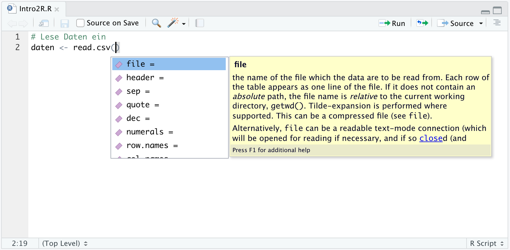
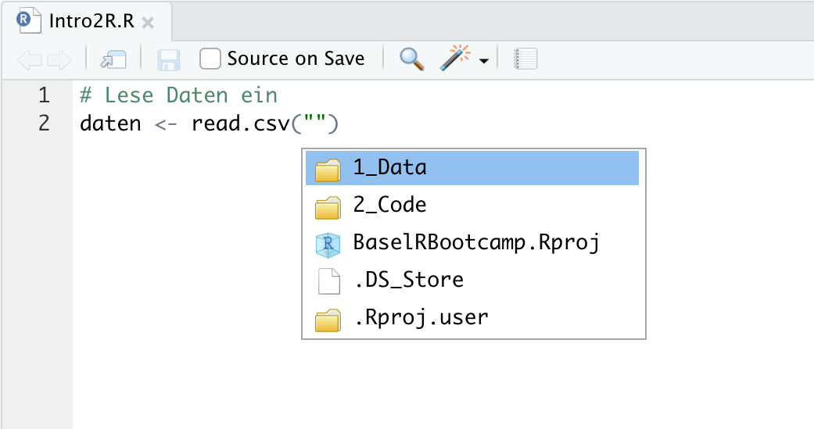
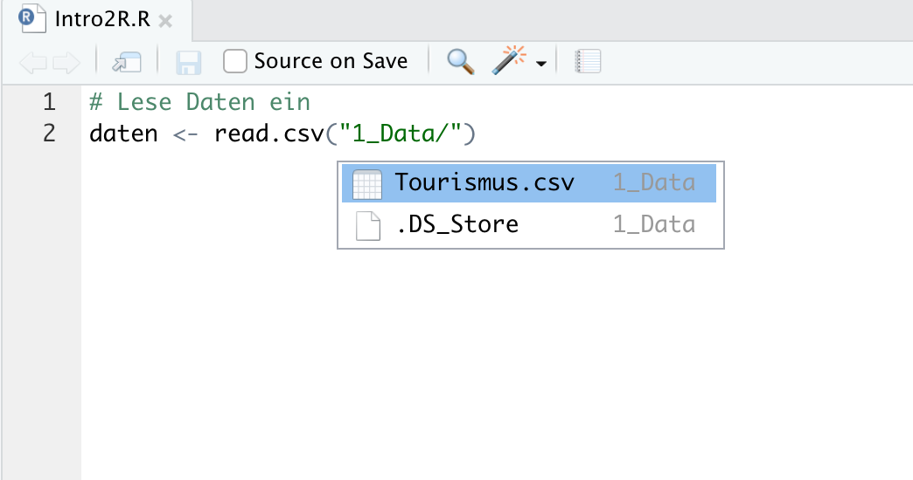

layout: true

<div class="my-footer">
  <span style="text-align:center">
    <span> 
      
    </span>
    <a href="https://therbootcamp.github.io/">
      <span style="padding-left:82px"> 
        <font color="#7E7E7E">
          www.therbootcamp.com
        </font>
      </span>
    </a>
    <a href="https://therbootcamp.github.io/">
      <font color="#7E7E7E">
      Einführung in die moderne Datenanalyse mit R | November 2019
      </font>
    </a>
    </span>
  </div> 

---

```{r setup, include=FALSE}
options(htmltools.dir.version = FALSE)
# see: https://github.com/yihui/xaringan
# install.packages("xaringan")
# see: 
# https://github.com/yihui/xaringan/wiki
# https://github.com/gnab/remark/wiki/Markdown
options(width=110)
options(digits = 4)

require(tidyverse)
```


# Agenda

.pull-left4[

1. R(Studio)<br>
2. Assignments<br>
3. Funktionen<br>
4. <high>Data I/O</high><br>
&nbsp;&nbsp;&nbsp;-Daten von Festplatte lesen<br>
&nbsp;&nbsp;&nbsp;-Daten leben in <mono>data.frames</mono><br>
&nbsp;&nbsp;&nbsp;-Daten auf die Festplatte schreiben<br><br>
5. Analyse

]

.pull-right5[
<p align = "center">
<br>
<font style="font-size:10px">from <a href="https://xkcd.com//">xkcd.com</a></font>
</p>

]

---

# Daten von Festplatte lesen

.pull-left4[

1. R(Studio)<br>
2. Assignments<br>
3. Funktionen<br>
4. Data I/O<br>
&nbsp;&nbsp;&nbsp;-<high>Daten von Festplatte lesen</high><br>
&nbsp;&nbsp;&nbsp;-Daten leben in <mono>data.frames</mono><br>
&nbsp;&nbsp;&nbsp;-Daten auf die Festplatte schreiben<br><br>
5. Analyse

]

.pull-right5[

```{r, echo = F}
options(max.print=50)
```

```{r}
# Lese Daten ein
read.csv('1_Data/Tourismus.csv')
```
]

---

# Daten von Festplatte lesen

.pull-left4[

1. R(Studio)<br>
2. Assignments<br>
3. Funktionen<br>
4. Data I/O<br>
&nbsp;&nbsp;&nbsp;-<high>Daten von Festplatte lesen</high><br>
&nbsp;&nbsp;&nbsp;-Daten leben in <mono>data.frames</mono><br>
&nbsp;&nbsp;&nbsp;-Daten auf die Festplatte schreiben<br><br>
5. Analyse

]

.pull-right5[

```{r, echo = F}
options(max.print=50)
```

```{r}
# Lese Daten in ein Objekt ein
daten <- read.csv('1_Data/Tourismus.csv')

# Printe Daten
daten

```
]


---

# Daten von Festplatte lesen

.pull-left4[

1. R(Studio)<br>
2. Assignments<br>
3. Funktionen<br>
4. Data I/O<br>
&nbsp;&nbsp;&nbsp;-<high>Daten von Festplatte lesen</high><br>
&nbsp;&nbsp;&nbsp;-Daten leben in <mono>data.frames</mono><br>
&nbsp;&nbsp;&nbsp;-Daten auf die Festplatte schreiben<br><br>
5. Analyse

]

.pull-right5[
<p align = "center">

</p>

]

---

# Daten von Festplatte lesen

.pull-left4[

1. R(Studio)<br>
2. Assignments<br>
3. Funktionen<br>
4. Data I/O<br>
&nbsp;&nbsp;&nbsp;-<high>Daten von Festplatte lesen</high><br>
&nbsp;&nbsp;&nbsp;-Daten leben in <mono>data.frames</mono><br>
&nbsp;&nbsp;&nbsp;-Daten auf die Festplatte schreiben<br><br>
5. Analyse

]

.pull-right5[
<p align = "center">

</p>

]


---

# Daten von Festplatte lesen

.pull-left4[

1. R(Studio)<br>
2. Assignments<br>
3. Funktionen<br>
4. Data I/O<br>
&nbsp;&nbsp;&nbsp;-<high>Daten von Festplatte lesen</high><br>
&nbsp;&nbsp;&nbsp;-Daten leben in <mono>data.frames</mono><br>
&nbsp;&nbsp;&nbsp;-Daten auf die Festplatte schreiben<br><br>
5. Analyse

]

.pull-right5[
<p align = "center">

</p>

]

---

# Daten von Festplatte lesen

.pull-left4[

1. R(Studio)<br>
2. Assignments<br>
3. Funktionen<br>
4. Data I/O<br>
&nbsp;&nbsp;&nbsp;-Daten von Festplatte lesen<br>
&nbsp;&nbsp;&nbsp;-<high>Daten leben in <mono>data.frames</mono></high><br>
&nbsp;&nbsp;&nbsp;-Daten auf die Festplatte schreiben<br><br>
5. Analyse

]

.pull-right5[

```{r, echo = F}
options(max.print=20,width=40)
```

```{r}
# Lese Daten in ein Objekt ein
daten <- read.csv('1_Data/Tourismus.csv')

# Klasse der Daten
class(daten)

# Dimensionen der Daten
dim(daten)

# Namen der Variablen in den Daten
names(daten)

```
]


---

# Daten von Festplatte lesen

.pull-left4[

1. R(Studio)<br>
2. Assignments<br>
3. Funktionen<br>
4. Data I/O<br>
&nbsp;&nbsp;&nbsp;-Daten von Festplatte lesen<br>
&nbsp;&nbsp;&nbsp;-<high>Daten leben in <mono>data.frames</mono></high><br>
&nbsp;&nbsp;&nbsp;-Daten auf die Festplatte schreiben<br><br>
5. Analyse

]

.pull-right5[

```{r, echo = F}
options(max.print=20,width=40)
```

```{r}
# Lese Daten in ein Objekt ein
daten <- read.csv('1_Data/Tourismus.csv')

# Extrahiere Land mit $
daten$Land

```
]

---

# Daten von Festplatte lesen

.pull-left4[

1. R(Studio)<br>
2. Assignments<br>
3. Funktionen<br>
4. Data I/O<br>
&nbsp;&nbsp;&nbsp;-Daten von Festplatte lesen<br>
&nbsp;&nbsp;&nbsp;-<high>Daten leben in <mono>data.frames</mono></high><br>
&nbsp;&nbsp;&nbsp;-Daten auf die Festplatte schreiben<br><br>
5. Analyse

]

.pull-right5[

```{r, echo = F}
options(max.print=20,width=40)
```

```{r}
# Lese Daten in ein Objekt ein
daten <- read.csv('1_Data/Tourismus.csv')

# Klasse der Land Variable
class(daten$Land)

```
]

---

# Daten von Festplatte lesen

.pull-left4[

1. R(Studio)<br>
2. Assignments<br>
3. Funktionen<br>
4. Data I/O<br>
&nbsp;&nbsp;&nbsp;-Daten von Festplatte lesen<br>
&nbsp;&nbsp;&nbsp;-<high>Daten leben in <mono>data.frames</mono></high><br>
&nbsp;&nbsp;&nbsp;-Daten auf die Festplatte schreiben<br><br>
5. Analyse

]

.pull-right5[

```{r, echo = F}
options(max.print=8,width=40)
```

```{r}
# Lese Daten in ein Objekt ein
daten <- read.csv('1_Data/Tourismus.csv',
                  stringsAsFactors = FALSE)

# Klasse der Land Variable
class(daten$Land)

# Extrahiere Land mit $
daten$Land

```
]


---

# Daten von Festplatte lesen

.pull-left4[

1. R(Studio)<br>
2. Assignments<br>
3. Funktionen<br>
4. Data I/O<br>
&nbsp;&nbsp;&nbsp;-Daten von Festplatte lesen<br>
&nbsp;&nbsp;&nbsp;-<high>Daten leben in <mono>data.frames</mono></high><br>
&nbsp;&nbsp;&nbsp;-Daten auf die Festplatte schreiben<br><br>
5. Analyse

]

.pull-right5[

```{r, echo = F}
options(max.print=80,width=40)
```

```{r}
# Lese Daten in ein Objekt ein
daten <- read.csv('1_Data/Tourismus.csv')

# Extrahiere Dauer mit $
daten$Dauer

```
]

---

# Daten von Festplatte lesen

.pull-left4[

1. R(Studio)<br>
2. Assignments<br>
3. Funktionen<br>
4. Data I/O<br>
&nbsp;&nbsp;&nbsp;-Daten von Festplatte lesen<br>
&nbsp;&nbsp;&nbsp;-<high>Daten leben in <mono>data.frames</mono></high><br>
&nbsp;&nbsp;&nbsp;-Daten auf die Festplatte schreiben<br><br>
5. Analyse

]

.pull-right5[

```{r, echo = F}
options(max.print=80,width=40)
```

```{r}
# Lese Daten in ein Objekt ein
daten <- read.csv('1_Data/Tourismus.csv')

# Extrahiere Dauer mit $
class(daten$Dauer)

```
]


---

# Daten von Festplatte lesen

.pull-left4[

1. R(Studio)<br>
2. Assignments<br>
3. Funktionen<br>
4. Data I/O<br>
&nbsp;&nbsp;&nbsp;-Daten von Festplatte lesen<br>
&nbsp;&nbsp;&nbsp;-Daten leben in <mono>data.frames</mono><br>
&nbsp;&nbsp;&nbsp;-<high>Daten auf die Festplatte schreiben</high><br><br>
5. Analyse

]

.pull-right5[

```{r, echo = F}
options(max.print=80,width=40)
```

```{r}
# Schreibe Daten auf die Festplatte als csv
write.csv(daten, '1_Data/Tourismus_neu.csv')

# Schreibe Daten auf die Festplatte als RDS
saveRDS(daten, '1_Data/Tourismus_neu.RDS')

```
]

---

class: middle, center

<h1><high>Interactive</high></h1>

