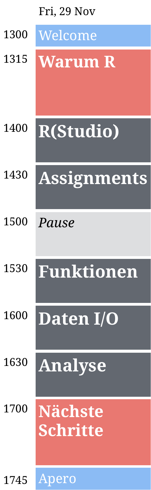

layout: true

<div class="my-footer">
  <span style="text-align:center">
    <span> 
      
    </span>
    <a href="https://therbootcamp.github.io/">
      <span style="padding-left:82px"> 
        <font color="#7E7E7E">
          www.therbootcamp.com
        </font>
      </span>
    </a>
    <a href="https://therbootcamp.github.io/">
      <font color="#7E7E7E">
       Machine Learning with R | October 2019
      </font>
    </a>
    </span>
  </div> 

---

```{r setup, include=FALSE}
options(htmltools.dir.version = FALSE)
# see: https://github.com/yihui/xaringan
# install.packages("xaringan")
# see: 
# https://github.com/yihui/xaringan/wiki
# https://github.com/gnab/remark/wiki/Markdown
options(width=110)
options(digits = 4)
```


.pull-left45[
<br><br><br><br><br>
#  Hello Machine Learning Experts!

In 2 days, 6 sessions, and 16 hours you have come a long way.

]

.pull-right4[


]

---

#  Welcome to the Data Revolution

.pull-left4[

<i>"Machine learning will be the engine of global growth."</i><br>

Financial times, July 2018

<i>"Fuel of the future - Data is giving rise to a new economy."</i><br>

The Economist, May 2017

<i>"Wie Big Data die Finanzmärkte verändern könnte"</i><br>

NZZ, August 2018

]

.pull-right55[
<p align="center">

</p>
]

---

# Changes to the economy

.pull-left4[
### Businesses employ AI/ML
<p align="left">
  
</p>
]

.pull-right55[
### Jobs become obsolete
<p align="left">
  
</p>
]

<!---<iframe width="1200" height="560" src="https://www.bloomberg.com/graphics/2017-job-risk/#dvz-asset-d3js-scatterplot-container" frameborder="0">
--->

---

#  Repeating the past

.pull-left35[
### A nerdy cartoon
<p align="center">

</p>

<p align = "center">
  <br>
  <font style="font-size:10px">from <a href="https://www.smbc-comics.com/comic/rise-of-the-machines">smbc-comics.com</a></font>
</p>


]

.pull-right6[
### The real world: Predictive policing
<a href="https://www.economist.com/briefing/2013/07/20/dont-even-think-about-it">The Economist</a><br>
<a href="http://harvardcrcl.org/minority-report-why-we-should-question-predictive-policing/">Harvard Civil Rights Review</a>
<p align = "center">
  <br>
  <font style="font-size:10px">from <a href="https://www.smithsonianmag.com/innovation/artificial-intelligence-is-now-used-predict-crime-is-it-biased-180968337/">smithsonianmag.com</a></font>
</p>


]


<!---

#  Repeating the past

.pull-left45[
### Recidivity risk scores
<p align="center">
  <br>
  <font style="font-size:10px">from <a href="https://www.propublica.org/article/machine-bias-risk-assessments-in-criminal-sentencing">propublica.org</a></font>
</p>
</p>

]

.pull-right45[
### Empirical evaluation
<a href="https://www.propublica.org/article/machine-bias-risk-assessments-in-criminal-sentencing">Pro Publica I</a>, 
<a href="https://www.propublica.org/article/how-we-analyzed-the-compas-recidivism-algorithm">Pro Publica II</a>

<p align = "center">
  <br>
  <font style="font-size:10px">from <a href="https://www.propublica.org/article/machine-bias-risk-assessments-in-criminal-sentencing">propublica.org</a></font>
</p>

]

--->

---

# The end of privacy

.pull-left3[

<i>"Most technologies have their bright and dark side [...] My personal opinion is that a machine's ability to better understand us would lead to improved consumer experience, products, etc… But imagine that we published a clone of youarewhatyoulike.com that simply predicted which of your friends was gay (or Christian or liberal or HIV-positive, etc); lynches are not unlikely to follow…"</i>

Michal Kosinski, Stanford University <a href="https://www.theguardian.com/world/2014/aug/03/internet-death-privacy-google-facebook-alex-preston" style="font-size:8px">[Full text]</a>

]

.pull-right65[

<p align = "center">
  <br>
  <font style="font-size:10px">from <a href="https://www.pnas.org/content/112/4/1036">pnas.org</a></font>
</p>

]


---

<div class="center_text_2">
  <span>
  What do you think?
  </span>
</div> 


---

# Next steps

.pull-left5[
<font size = 4><i>
<font size = 6>
1. Practice<br>
2. Read books<br>
3. Consult websites<br>
4. Support & consulting<br>
5. Upcoming courses<br>
]

</font>
<br>

.pull-right5[
<p align="center"></p>
]

---

# Books

Here is a very incomplete series of good books. They are ordered by complexity, beginning with user-friendly books on <high>learning statistics</high> in R and ending with books focusing on the more <high>advanced topics of the R language</high>.


<table width="100%" style="cellspacing:0; cellpadding:0; border:none;">

  <tr>    


    <td>
  <a href="http://appliedpredictivemodeling.com/"></a>
  </td>
  
      <td>
  <a href="http://www-bcf.usc.edu/~gareth/ISL/ISLR%20First%20Printing.pdf"></a>
  </td>
  
        <td>
  <a href="https://www.manning.com/books/deep-learning-with-r"></a>
  </td>

  
  <td>
  <a href="https://www.tidytextmining.com/"></a>
  </td>
  
  <td>
  <a href="https://www.orellfuessli.ch/shop/home/artikeldetails/ID35367941.html?ProvID=10917736&gclid=Cj0KCQiAg_HhBRDNARIsAGHLV5238Q26gQmFttHRnYGjcAhz4CslStb-3qBegvuZS5gnCpWSLNlQvF0aAgfOEALw_wcB"></a>
  </td>
  
  </tr>
  

  <tr style="background-color:#ffffff">

    <td> 
  <a href="http://r4ds.had.co.nz/"></a>
  </td>

  <td>
  <a href="https://covers.oreillystatic.com/images/0636920028574/cat.gif"></a>
  </td>

        <td>
  <a href="https://csgillespie.github.io/efficientR/"></a>
  </td>

  <td>
  <a href="www.rcpp.org/"></a>
  </td>
  
  
  <td>
  <a href="http://adv-r.had.co.nz/"></a>
  </td>


  </tr>
  


</table>
<br>


---

.pull-left4[

# Websites

The web is a great place to learn about R. 

<font size = 4><i>Best begin your journey with:</i></font>

[Google](www.google.com) or [Rseek](www.rseek.org), which is a wrapper around google to maximize hits related to R. However, most of the time Google works just fine. Just be sure to add *r* to the the search query. 

<font size = 4><i>Then you will be redirected to one of two pages</i></font>

[R-bloggers](www.r-bloggers.com) is a website on which R users inform each other on the newest developments. See, e.g., Nathaniel's [entry](https://www.r-bloggers.com/the-new-and-improved-pirateplot-now-with-themes/).

[Stackoverflow](www.r-bloggers.com) is a website on which R users exchange problems and solutions to problems. Try post something yourself. You will be amazed by the turnaround. 


]

.pull-right5[
<p align="left" style="padding: 0 0px"><br><br><br><br><br><br><br><br><br>
    <a href="https://www.google.com/"></a><a href="http://rseek.org/"></a><br><br><br2>
    <a href="https://www.r-bloggers.com/"></a><br>
  <a href="https://stackoverflow.com/"></a>
</p>
]


---

# Support & Consulting

<table class="tg"  style="cellspacing:0; cellpadding:0; border:none">
  <tr>
    <th class="tg-yw4l" valign='top'>
    <p align="center"><br>
    <a href="www.dirkwulff.org"></a><br>
    <p align="center">
    <font size = 5>Dr. Dirk Wulff</font><br><br>
    <a href="www.dirkwulff.org"><b>dirkwulff.org</b></a><br>
    <a href="https://github.com/dwulff"><b>github.com/dwulff</b></a><br>
    <font size=4><i>packages: </i></font> 
    <a href="https://cran.r-project.org/web/packages/cstab/index.html"><b>cstab</b></a>, <br>
    <a href="https://cran.r-project.org/web/packages/mousetrap/index.html"><b>mousetrap</b></a>, <a href="https://cran.r-project.org/web/packages/memnet/index.html"><b>memnet</b> <a href="https://github.com/dwulff/choicepp"><b>choicepp</b>
    </p>  
  </th>
  
  <th class="tg-yw4l" valign='top'><p align="center"><br>
    <a href="https://psychologie.unibas.ch/en/persons/markus-steiner/about-me/"></a><br>
    <p align="center">
    <font size = 5>Markus Steiner</font><br><br>
    <a href="https://github.com/mdsteiner"><b>github.com/mdsteiner</b></a><br>
    <font size=4><i>packages: </i></font> 
    <a href="https://github.com/mdsteiner/ShinyPsych"><b>ShinyPsych</b></a>, <br>
    <a href="https://github.com/mdsteiner/EFAdiff"><b>EFAdiff</b></a> <br><br>
    </p>
  </th>
  
  <th class="tg-yw4l" valign='top'>
    <p align="center">
    <p align="center"><br>
    <a href="https://www.schulte-mecklenbeck.com/"></a><br>
    <p align="center">
    <font size = 5>Dr. Michael Schulte-<br>Mecklenbeck</font><br><br>
    <a href="www.schulte-mecklenbeck.com"><b>schulte-mecklenbeck.com</b></a><br>
    <a href="https://github.com/schultem"><b>github.com/schultem</b></a><br><br>
    </p>
  </th>


</tr>

</table>

---


# Upcoming courses


<table class="tg"  style="cellspacing:0; cellpadding:0; border:none;">
<tr valign="top">
  <td>
    <p align="center">
      <a class="project-link" href="mailto:therbootcamp@gmail.com?subject=Preregistration for Statistics with R&body=I would like to preregister for the R Bootcamp on 'Data Mining mit R' on February 14/15 in Basel, Switzerland." align="center">
      <font style="font-size:20px;weight:700"><br>Data Mining mit R</font><br>
      <br>
      </img><br><br>
      <high>2 days, February 14/15, 2020</high><br><br><br>
    </p>
  </td>
  <td>
    <p align="center">
      <a class="project-link" href="mailto:therbootcamp@gmail.com?subject=Preregistration for Statistics with R&body=I would like to preregister for the R Bootcamp on 'Statistik mit R' on March 13/14 in Basel, Switzerland." align="center">
      <font style="font-size:20px;weight:700"><br>Statistik mit R</font><br>
      <br>
      </img><br><br>
      <high>2 days, March 13/14, 2019</high><br><br><br>
      </a>
    </p>
  </td>
  <td>
    <p align="center">
      <a class="project-link" href="mailto:therbootcamp@gmail.com?subject=Preregistration for Statistics with R&body=I would like to preregister for the R Bootcamp on 'Reporting mit R' on March 13/14 in Basel, Switzerland." align="center">
      <font style="font-size:20px;weight:700"><br>Statistik mit R</font><br>
      <br>
      </img><br><br>
      <high>2 days, May 15/16, 2019</high><br><br><br>
      </a>
    </p>
  </td>
  </tr>


---

.pull-left45[
# Please give us feedback
<br><br>

<p align = "center">
  </img><br>
  <font style="font-size:10px">from <a href="https://cdn-images-1.medium.com/max/1600/1*5OZNYAfzDZfM1lwJBZEuHQ.png">medium.com</a></font>
</p>

]

.pull-right45[

<p align="center"><br><br><iframe src="https://docs.google.com/forms/d/e/1FAIpQLSfkjB8ka35FCiffvdnzP7gdu_RcG_GshXAu0DozIgVgH09jlw/viewform?embedded=true" width="430" height="550">Wird geladen...</iframe></p>

]

---
class: center, middle

# Thank you! and one more thing...

<!-- <a href="http://i.imgur.com/PgtvQar.png"><font size=5>Here is an R Joke.</font></a><br><br> -->
<!-- <font size=5>And now one more thing</font>... -->
